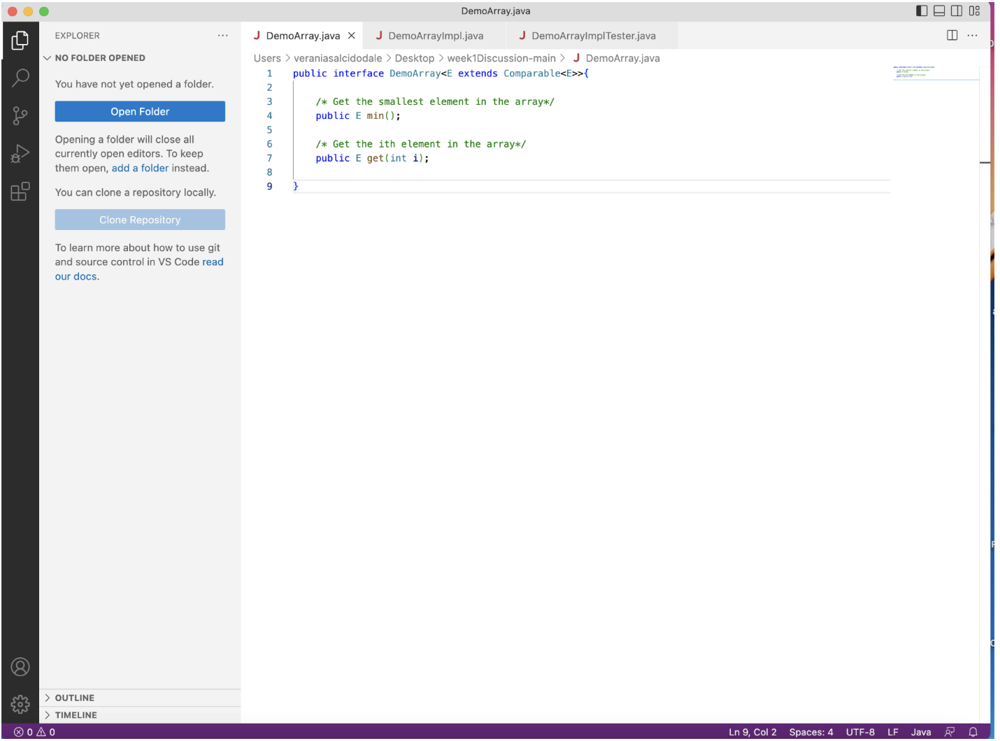
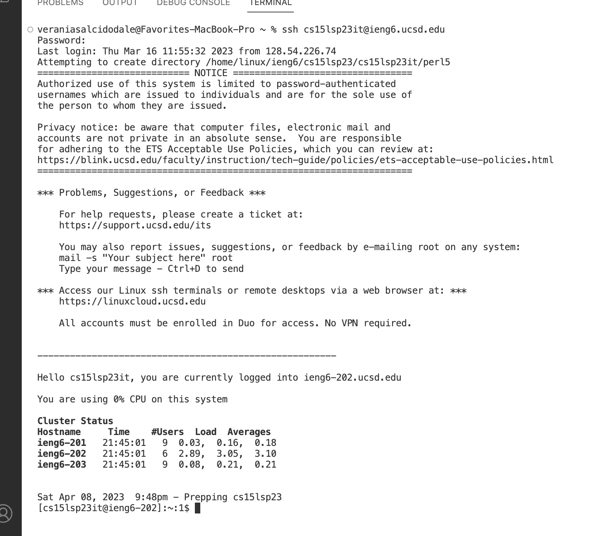

# Lab Report 1
## Installing VS Code
- When getting into the lab, the first step we have to do to get everything set up is installing VS code either on your personal computer or using 
  the lab computer, in which VS Code is already downloaded.
  If using your personal computer, you would need to download VS Code on the VS Code website and there should be an option to download the application
  on your computer. After downloading VS Code, we were advised to take a screenshot to prove that all of us in our group were on the same page, which 
  should look similar to this : 
  
## Remotely Connecting
- The next step that we have to take would be that once we have VS code open, we need to find where to open the terminal. Once we have the terminal open, we are supposed to use the commmand *ssh* and right after type your account associated with our cse 15L lab. Once we physically type out the first time around, *ssh cse15lsp23( this part contains your specific info letters)@ieng6.ucsd.edu* we will then get a specific message that asks the user if they are certain they want to connect to the server. After you type out *yes*, you will then get a message that greets you and gives you information on certain information found on your computer. So if you were to do this it would look something like this: 

## Trying Some Commands
- In the final step of the lab, we were able to test out different commands on the terminal. A couple of the commands that were able to test out were *cd , ls, pwd, mkdir,* and *cp*. Some specific commands that were tested on the terminal were *cd ~, cd, ls -lat, ls -a, 
cp /home/linux/ieng6/cs15lsp23/public/hello.txt ~/ ,* and *cat /home/linux/ieng6/cs15lsp23/public/hello.txt*. I did try out mos tof them on my terminal bu the most interesting one I tested was *ls- lat* because it shocked me on how much information it printed out. I noticed that *ls -lat* produced some type of list that had lots of what it looked like access information to certain apps off my computer, which caught my eye with the long list it produced. The *ls -lat* command ended up looking like this on my terminal : ![Image](
